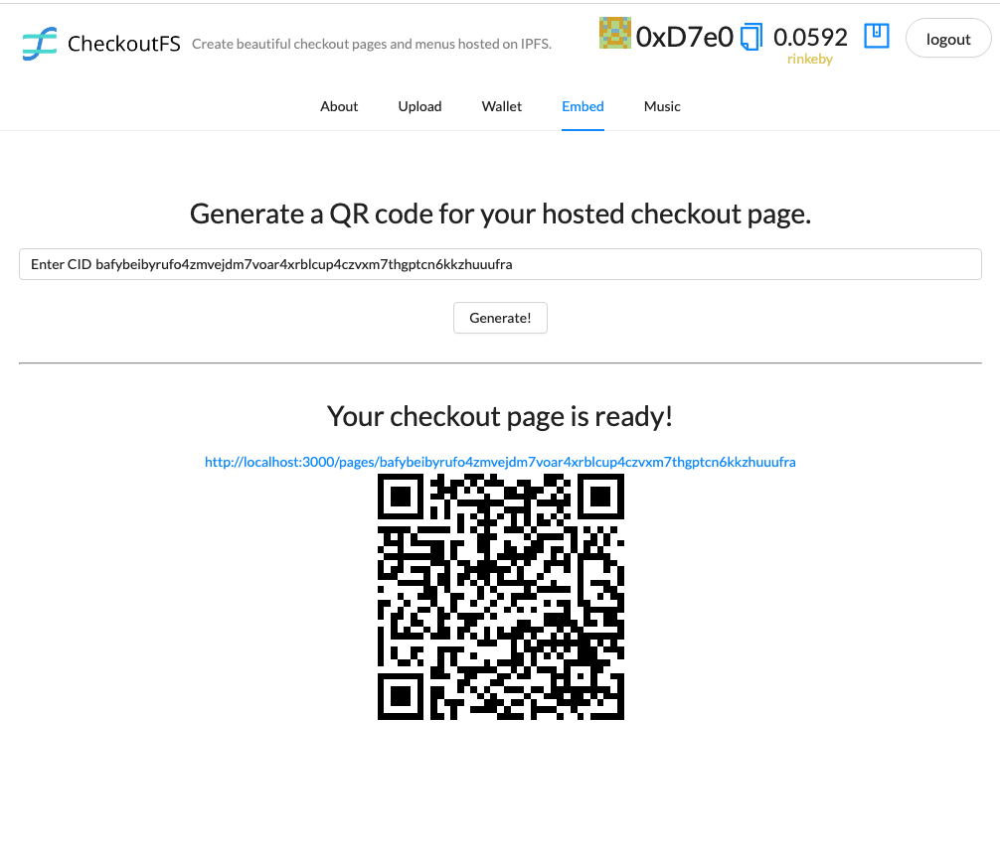

    

## CheckoutFS

Create instant checkout pages for your business or service hosted on IPFS.

Built for the HackFS 2021 hackathon.

### Features

- Discover existing catalogs and menus. Use the cid as the primary key for storefront access.
- Upload images and descriptions for the catalog.
- Show sharable product page hosted on IPFS.
- Integrated pricing and checkout.
- Create a new wallet to support payments to help new businesses adopt and receive cryptocurrency payments.
- IPFS powered storage and transaction record keeping.

### Inspiration

Pain points:

- To create a hosted product catalog, usually you'd need to pay a hosted provider like squarespace or shopify.
- Many of these existing providers don't integrate cryptocurrency
- Providers aren't distributed and suffer downsides of existing centralized platforms (vendor lock in, variable pricing, outages, etc.)

### Technologies used

- IPFS and Protocol labs (Hosting and sharing of assets): IPFS and Filecoin are the primary drivers making CheckoutFS possible. Using web3.storage, a storefront or product page creator can host a distributed menu or catalog of items available for purchase with cryptocurrency.
- Pillar (payments and wallet creation for uploaders) \* Enables wallet generation and onboarding for businesses that may not have crypto accounts already. Pillar exists on the wallet page and is integrated live to validate that a customer's web3 wallet is ready to accept payments. Pillar is also leveragable for the checkout process which would need further development.
- Unlock Protocol (purchasing): Provides cryptocurrency gateway to enable visitors/customers to purchase items from the checkout page. https://app.unlock-protocol.com/dashboard
- Audius: Music sharing and content listings. Audius API is integrated into the product for musicians to be able to sell rights/use to their music through catalog pages. Lookup any playlist ID and get an instant page.
- Ceramic: Used for storefront metadata storage and retrieval using streams (community node: https://developers.ceramic.network/run/nodes/community-nodes/). When a product page is accessed, a ceramic stream with the streamId of the page cid is opened and the metadata is rendered with the products from IPFS.
- Fluence: Price oracle interaction for rendering real time USD quotes on checkout pages based on latest Eth price (fluence enables doing this without a deployed smart contract or other oracle).

### How to run

Define the following env variables

<pre>
    REACT_APP_STORAGE_KEY = {YOUR_WEB3_STORAGE_KEY}
</pre>

`yarn; yarn start`

Example simple checkout page already hosted on IPFS: http://localhost:3000/pages/bafybeid67zzz5auzpc2botitsrp2lh2ybutnqkw3mej4s6dlrkthhmis5q

### Aqua / Fluence

WIP
For price oracle, regenerate aqua script file with `js` flag.

<pre>
npm i -g @fluencelabs/aqua-cli # install aqua cli
cd `/aqua`
aqua-cli -i aqua-scripts -o aqua-output --js
</pre>

ex: https://github.com/fluencelabs/examples/tree/ae3b23c99e5a23f7da99a22bf5a6877109ae7982/aqua-examples/ts-oracle

<!--
Demo flow:
1. Intro (compare with shopify)
2. Assets (IPFS / filecoin)
3. Upload (IPFS / filecoin)
4. Generate CID with hosted content (IPFS / filecoin)
5. QR Code for page.
6. Preview page (fluence, ceramic)
7. Show checkout modal (unlock).
8. Music page
9. Generate wallet to receive funds (pillar)

-->

### Enhancements

- Integrate payments and checkout flows directly from the catalog (enabling the product to be used table side). Currently this is using a fixed Unlock.js modal.
- Add support for physical address collection for physical or remote item purchase.
- Email integration via fluence backend.
- IPNS publishing and fully custom domains.

## Screenshots

### Home

### Creating a new storefront

### Upload complete

### Creating shortcut or scannable link

### Basic storefront

### Music-resell storefront

### Verifying wallet

<!--
### Other links
* https://www.notion.so/Prizes-HackFS-d2aeebcda5694c7a9c06dc7aa2b7a2d8
* https://www.qr-code-generator.com/qr-code-api/?target=api-ad

React
* https://www.npmjs.com/package/react-catalog-view
* https://www.npmjs.com/package/react-image-gallery

-->
